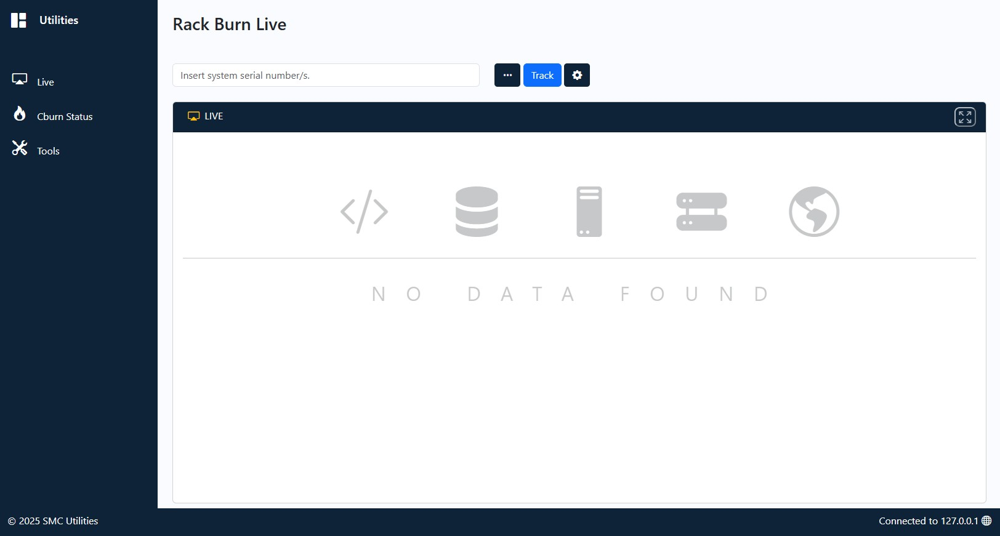
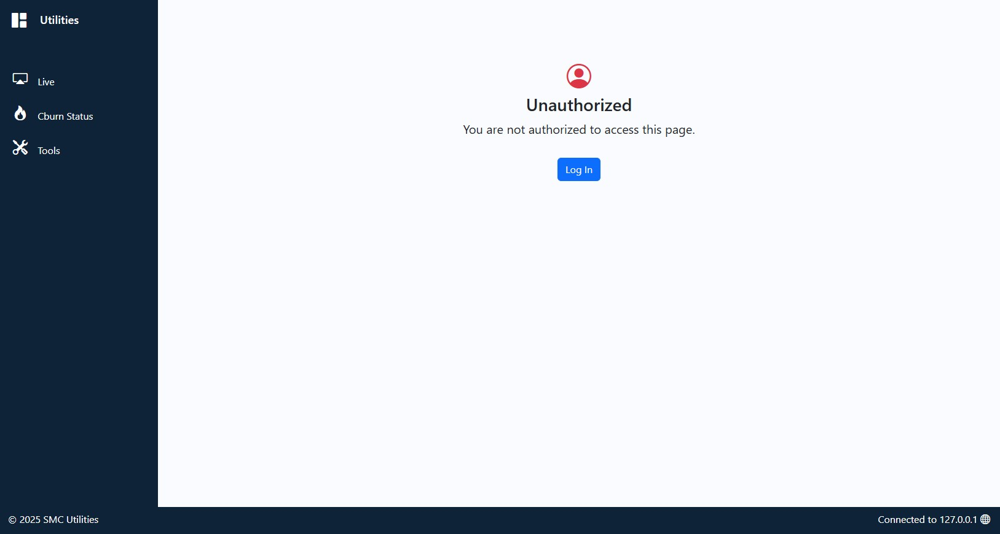
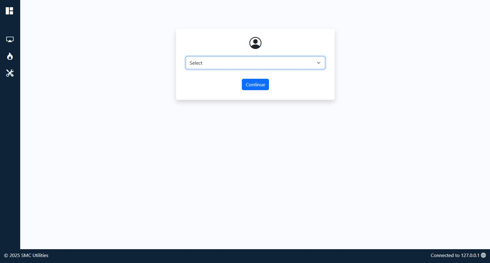
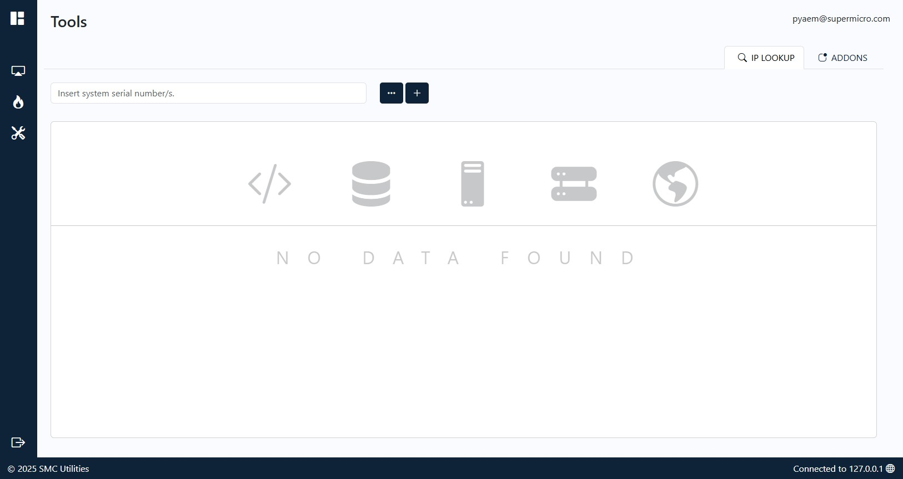
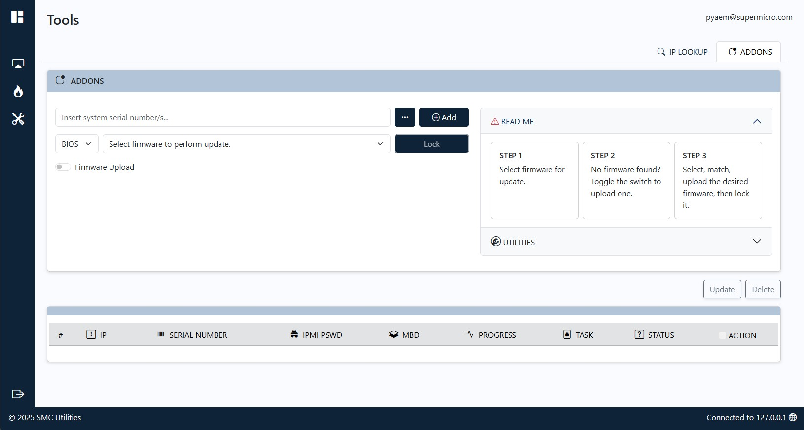

## PROJECT STRUCTURE
```
.
├── main
│   ├── __init__.py
│   ├── core.py
│   ├── extensions.py
│   ├── firmware_info.py
│   ├── ftu_helper.py
│   ├── cburn_helper.py
│   ├── rburn_helper.py
│   ├── tools.py
│   └── search.py
├── templates
│   ├── base.html
│   ├── index.html
│   ├── cburn_log.html
│   ├── ftu_log.html
│   ├── rburn_log.html
│   ├── tools.html
│   ├── construction.html
│   ├── input_form.html
│   ├── ip_lookup.html
│   ├── nodata.html
│   ├── unauthorized.html
│   └── update_commands.html
├── static
│   ├── css
│   ├── js
│   └── images
├── instance
│   └── database.db
├── models
│   └── models.py
├── config.py
├── app.py
```

## Application Showcase

### Home - Live



### Tools - User Authentication





### Tools - IP LOOKUP



### Tools - ADDONS



---

### Live Demo

https://github.com/user-attachments/assets/260d0923-0091-49bb-bc7c-d186702a135a

